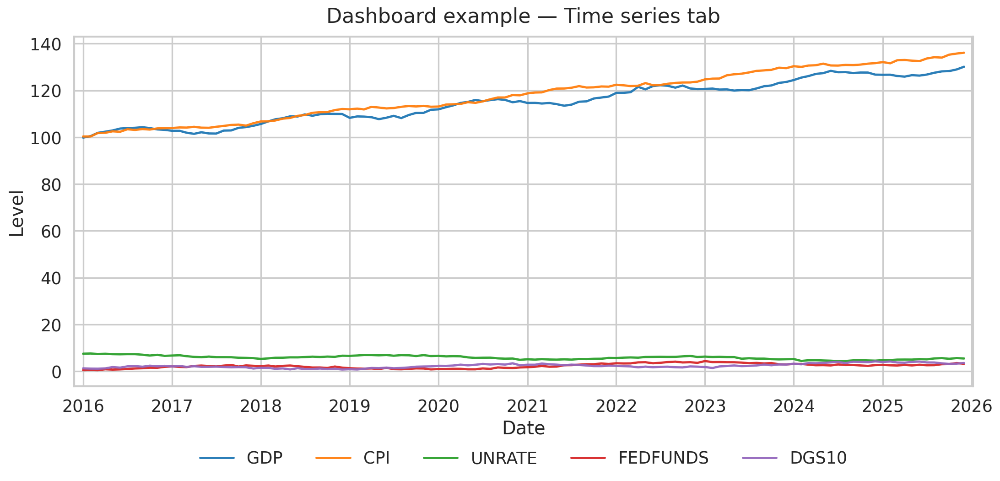
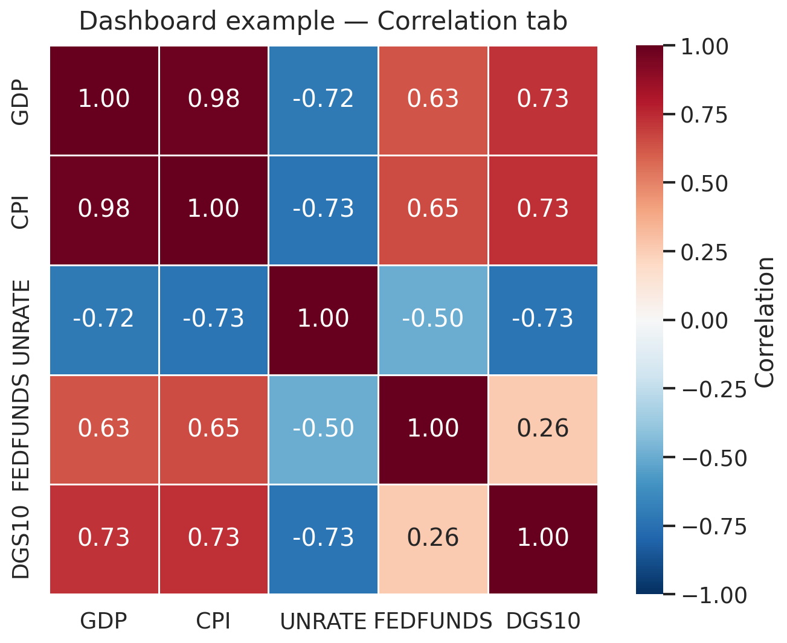
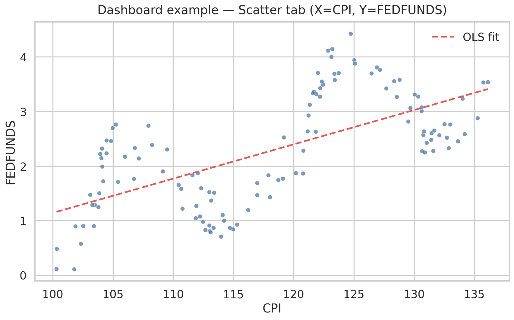

# lazy_fred

Simple FRED data pulls for first-time Python users, plus optional alignment, charts, and a guided wizard.

## Beginner

**You need**

- **Python** 3.10+
- A **FRED API key** from [FRED](https://fred.stlouisfed.org/docs/api/api_key.html), set as `API_KEY` or `FRED_API_KEY` (environment variable or `.env`)

**Install**

```bash
python -m pip install --upgrade lazy_fred
```

**First run**

1. Check your setup: `lazy-fred doctor`
2. Pull a small preset: `lazy-fred quick` (same categories as `favorites macro`)

That writes CSVs such as `daily_data.csv`, `weekly_data.csv`, and `monthly_data.csv` in the current directory. Earlier runs are copied to `backups/<timestamp>/` before overwrite.

**If a command is not found**

Reinstall and open a new terminal: `python -m pip install --upgrade lazy_fred`. For API key problems, confirm the key on FRED and run `lazy-fred doctor`.

---

## Intermediate

### Installation options

**Optional dashboard** (Streamlit + Plotly):

```bash
python -m pip install "lazy_fred[dashboard]"
```

**Poetry** (from a clone):

```bash
poetry install --with dev
poetry install --extras dashboard   # dashboard only
```

### `lazy-fred` (main CLI)

| Command | What it does | Best for |
|---------|----------------|----------|
| *(no arguments)* | Interactive session: manage category list, `run` / `run-all`, optional start date | Custom category sets |
| `lazy-fred doctor` | Python version, API key, write access, live FRED ping | First run / debugging |
| `lazy-fred quick` | Pulls **quick** preset (same categories as `favorites macro`) | Fast validation |
| `lazy-fred standard` | Pulls first **12** default search categories | Normal usage |
| `lazy-fred full` | Pulls **all** default search categories | Full default dataset |
| `lazy-fred favorites <profile>` | Pulls a themed subset (non-interactive) | One-shot themed pulls |
| `lazy-fred master [--start YYYY-MM-DD] [--out master_data.csv]` | Full default pull + one metadata-enriched long CSV | Easiest all-in-one export |

**Favorites profiles** (argument is the profile name):

| Profile | Themes (search categories) |
|---------|----------------------------|
| `macro` | gdp, inflation, unemployment, interest rates |
| `rates` | interest rates, exchange rates, monetary data |
| `labor` | employment, job opening, labor turnover, income |
| `markets` | financial indicator, banking, housing, retail trade |

Default profile if omitted: `macro` (i.e. `lazy-fred favorites` → `lazy-fred favorites macro`).

**One-shot master export** (great for new users):

```bash
lazy-fred master
# optional
lazy-fred master --start 2010-01-01 --out all_series_master.csv
```

This command runs the **full** default category pull and writes a single long file (default: `master_data.csv`) with observation rows plus metadata columns from `filtered_series.csv`, including a plain-language `series_description`.

Interactive menu shortcuts: `a` add, `r` remove, `c` clear, `rs` reset defaults, `run`, `run-all`, `q` quit. You can set an **observation start date** when prompted for `run` / `run-all`.

### `lazy-fred-wizard`

Guided **Rich** + **InquirerPy** flow: API key → search/select series → lookback → confirm → fetch and write CSVs. Optionally stores runs in a local **SQLite** database (`lazy_fred_history.db`), reconciles revised FRED values, and saves named configs under `.lazy_fred_configs/` for reuse.

```bash
lazy-fred-wizard
# or: python -m wizard
```

### `lazy-fred-dashboard`

Streamlit app for exploring **already pulled** CSVs in a directory.

```bash
lazy-fred-dashboard
```

Requires the `[dashboard]` extra. From the directory that contains your CSVs, start the app and use the sidebar for paths, alignment options, and series selection.

### Dashboard examples

Below are example visuals showing the dashboard output style.

#### Time series tab



#### Correlation tab



#### Scatter tab (with OLS fit)



**Sidebar**

- Working directory (where `daily_data.csv` / `weekly_data.csv` / `monthly_data.csv` live)
- Target frequency: Daily / Weekly / Monthly / Quarterly
- Downsample aggregation: `last`, `mean`, `sum`
- Upsample method: `ffill`, `linear`
- Optional date range filter
- Series display scale: **levels**, **index_100** (rebase to 100), **yoy_pct** (year-over-year %)
- Multiselect series; button to save **`aligned_master.csv`** (wide)

**Tabs**

- **Time series** — Plotly lines for selected series
- **Correlation** — Heatmap of pairwise correlations
- **Scatter** — Choose X/Y series, scatter + OLS fit line

### Python API (`import lazy_fred`)

| Symbol | Role |
|--------|------|
| `run_fred_data_collection(api_key, ...)` | Core pull: `categories=`, `interactive=True/False`, `observation_start=` (ISO date string) |
| `run_starter_mode(api_key, mode)` | `mode` ∈ `quick`, `standard`, `full` |
| `run_favorites(api_key, profile)` | `profile` ∈ `macro`, `rates`, `labor`, `markets` |
| `run_doctor()` | Same checks as CLI doctor |
| `run_master_bundle(api_key, ...)` | One-shot full pull + metadata-enriched `master_data.csv` |
| `launch_notebook_ui(api_key=None)` | Widget UI in Jupyter/Colab (needs `ipywidgets`) |
| `main` | CLI entry used by `lazy-fred` |
| `AccessFred`, `CollectCategories` | Lower-level building blocks for custom workflows/tests |

Example:

```python
import os
import lazy_fred as lf

api_key = os.environ["API_KEY"]
lf.run_favorites(api_key, "rates")
# or
lf.run_fred_data_collection(
    api_key,
    categories=["gdp", "inflation"],
    interactive=False,
    observation_start="2010-01-01",
)
```

### `panel` module (aligned master data)

Scriptable alignment **without** Streamlit. Uses `daily_data.csv`, `weekly_data.csv`, `monthly_data.csv`, and optional `filtered_series.csv` metadata.

| Function | Purpose |
|----------|---------|
| `read_filtered_metadata(path)` | Load `filtered_series.csv` metadata |
| `load_master_long(base_dir, ...)` | Combine long CSVs + optional metadata |
| `build_aligned_panel(master_long, target_freq, ...)` | Wide panel: rows = dates at target **D** / **W** / **M** / **Q**; `reducer` `last`/`mean`/`sum`; `upsample_method` `ffill`/`linear`; optional `start`/`end`/`series_ids` |
| `transform_master_timeframe(master_long, target_freq, ...)` | Convert mixed-frequency master data to one timeframe; can evenly distribute weekly/monthly/quarterly totals across days for daily targets, roll up to W/M/Q, and return modeling-optimized long/wide output |
| `wide_to_long(wide)` | Stack wide → long |
| `write_aligned_master_csv(wide, path, long_format=False)` | Write aligned CSV |
| `correlation_matrix(wide, min_periods=2)` | Pearson correlation matrix |

Example:

```python
from panel import (
    load_master_long,
    transform_master_timeframe,
    write_aligned_master_csv,
)

master = load_master_long(".")
wide = transform_master_timeframe(
    master,
    target_freq="M",
    reducer="sum",
    optimize_for_modeling=True,
    as_wide=True,
    fill_method="ffill",
)
write_aligned_master_csv(wide, "aligned_master.csv")
```

### Output files

| File / path | Description |
|-------------|-------------|
| `filtered_series.csv` | Series metadata from the search phase |
| `daily_data.csv`, `weekly_data.csv`, `monthly_data.csv` | Long-format observations (`date`, `series`, `value`) |
| `backups/<timestamp>/` | Prior copies of the main CSVs before overwrite |
| `pull_failures.csv` | Rows for series that could not be fully pulled (if any) |
| `app.log` | Debug log from the main CLI module |

**Wizard-only (current directory)**

- `lazy_fred_history.db` — SQLite run and observation history
- `.lazy_fred_configs/` — Saved named configurations

### Troubleshooting

- **Colab function missing** — Install latest from GitHub (see Advanced) and restart runtime
- **Run seems slow** — Expected for large pulls under FRED quotas; try `quick` or a `favorites` profile first
- **Dashboard import error** — Install with the `[dashboard]` extra

---

## Advanced

### Capabilities at a glance

| Area | What it does |
|------|----------------|
| **Main CLI** (`lazy-fred`) | Health check, preset pulls, themed “favorites,” or a full **interactive** menu to add/remove categories and run collection |
| **Wizard** (`lazy-fred-wizard`) | Step-by-step pick of series, lookback, CSV export, optional **SQLite** history and saved configs |
| **Library** (`import lazy_fred`) | Programmatic pulls, doctor, starter/favorites modes, **Jupyter/Colab** widget UI |
| **`panel` module** | Load CSV outputs into one long table, **align** mixed D/W/M (and Q) frequencies, correlations, export aligned CSV |
| **Dashboard** (`lazy-fred-dashboard`) | **Streamlit** UI: aligned panel, time series, correlation heatmap, scatter + OLS line, display scaling |

### Panel alignment conventions

Weekly alignment uses `W-SUN`; monthly uses month-end (`ME`); quarterly uses quarter-end (`QE-DEC`). Upsampling forward-fills (or linear interpolation) until the next observation; downsampling uses your chosen reducer.

The legacy script [`mergefred.py`](mergefred.py) is superseded by [`panel.py`](panel.py) for reproducible alignment.

### Time and retry behavior

- Terminal shows estimate, elapsed time, and ETA while running.
- API calls use **exponential backoff** for rate limits and transient errors.
- Start date: interactive prompts for `run` / `run-all`, or pass `observation_start` / notebook date picker when using the API or Colab UI.

### Colab / Jupyter UI

```python
!pip install -U lazy_fred ipywidgets
import lazy_fred as lf
from google.colab import userdata

lf.launch_notebook_ui(userdata.get("fred_api_key"))
```

If `launch_notebook_ui` is missing in Colab, install the latest package or source:

```python
!pip install -U "git+https://github.com/Jmetrics86/lazy_fred.git"
```

## License

MIT
